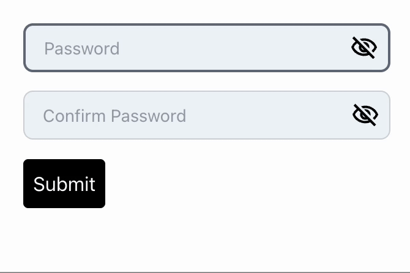

# Overview

A customizable React component for password input fields with real-time strength validation and visibility toggles.

[](https://www.npmjs.com/package/validate-password-strength)
[](https://www.npmjs.com/package/validate-password-strength)
[](https://www.npmjs.com/package/validate-password-strength)
[](https://github.com/your-username/validate-password-strength/blob/main/LICENSE)
[](https://libraries.io/npm/validate-password-strength)


## 🚀 Why Choose This Package?

- **`Customizable Rules`**: Define minimum length, number of uppercase/lowercase characters, digits, and special characters.
- **`Dual Input Fields`**: Includes both password and confirm password fields with built-in match validation.
- **`Visibility Toggle`**: Eye icons toggle password visibility for both fields.
- **`Real-Time Strength Indicator`**: Clearly shows password strength (Weak, Medium, Strong) as users type.
- **`Contextual Error Messages`**: Displays tailored messages for un-met requirements.
- **`Custom Styling`**: Easily apply your own styles or class names for design consistency.
- **`TypeScript Support`**: Full typing for IDE autocompletion and safety.
- **`Flexible Props`**: Pass additional input props to integrate seamlessly into any form.

## 📸 Demo



The code for this is given under `Basic Usage` section below.

## 📦 Installation


Before using the package, make sure you have the following peer dependencies installed:

- `react`
- `react-dom`
- `react-icons`

You can install them using npm or yarn:

```bash
# Using npm
npm install react react-dom react-icons

# Or using yarn
yarn add react react-dom react-icons
```
After installing the above dependencies, do the following to install package.
### Install via npm

`npm install validate-password-strength --save`

### Install via yarn

`yarn add validate-password-strength`

## ⚙️ Setup & Basic Usage

```javascript
import { PasswordFieldWithStrength } from "password-strength-indicator";
import "password-strength-indicator/style";
import { useRef } from "react";

function Example() {
  const passwordRef = useRef(null);

  const handleSubmit = () => {
    if (passwordRef.current?.validate()) {
      const values = passwordRef.current.getValues();
      console.log("Valid!", values);
      alert("login");
    } else {
      console.log("Validation failed");
    }
  };

  return (
    <div style={{ width: "300px", margin: "2rem auto" }}>
      <PasswordFieldWithStrength
        ref={passwordRef}
        minLength={10}
        minNumbers={3}
        minLowercase={2}
        minUppercase={2}
        minSpecialChars={2}
      />
      <button
        onClick={handleSubmit}
        style={{
          marginTop: "1rem",
          background: "black",
          color: "white",
          padding: "0.5rem",
          borderRadius: "4px",
        }}
      >
        Submit
      </button>
    </div>
  );
}

export default Example;
```

## 🔐 Password validating criteria

Password strength is based on 3 main criteria. Regex is used to implement those (The below only shows about default minimum values):

- `Weak passwords` - Less than 8 characters.
- `Medium passwords` - At least 8 characters but lacks variety (e.g., only lowercase)
- `Strong passwords` - 8+ characters with at least 1 lowercase, 1 uppercase, 1 number, and 1 special character(from the set `!@#*$%^&+=` ).

## 🔧 Customizable Props

| Prop Name                         | Type            | Affects / Description                                              |
| --------------------------------- | --------------- | ------------------------------------------------------------------ |
| `minUppercase`                    | `number`        | Minimum number of uppercase letters (default -1)                   |
| `minLowercase`                    | `number`        | Minimum number of lowercase letters (default -1)                   |
| `minNumbers`                      | `number`        | Minimum number of numbers (default -1)                             |
| `minSpecialChars`                 | `number`        | Minimum number of special characters (default -1)  `!@#*$%^&+=`    |
| `minLength`                       | `number`        | Minimum number of total characters (default -8)                    |
| `inputStyle`                      | `CSSProperties` | Inline styles for both password and confirm password input fields. |
| `passwordInputWrapper`            | `CSSProperties` | Styles the wrapper around the password input field.                |
| `iconContainer`                   | `CSSProperties` | Styles the visibility toggle icon container.                       |
| `smallIcon1`                      | `CSSProperties` | Style for small "hide" icon (when password is visible).            |
| `largeIcon1`                      | `CSSProperties` | Style for large "hide" icon (when password is visible).            |
| `smallIcon2`                      | `CSSProperties` | Style for small "show" icon (when password is hidden).             |
| `largeIcon2`                      | `CSSProperties` | Style for large "show" icon (when password is hidden).             |
| `strengthTextCommon`              | `CSSProperties` | Common style applied to all strength texts.                        |
| `errorMessagePassword`            | `CSSProperties` | Style for password-specific error messages.                        |
| `errorMessageText`                | `CSSProperties` | Style for general validation error messages.                       |
| `strengthColor1`                  | `CSSProperties` | Style for "Weak" password strength text.                           |
| `strengthColor2`                  | `CSSProperties` | Style for "Medium" password strength text.                         |
| `strengthColor3`                  | `CSSProperties` | Style for "Strong" password strength text.                         |
| `confirmPasswordWrapper`          | `CSSProperties` | Styles the wrapper around the confirm password input.              |
| `wrapperClassName`                | `string`        | Custom class name for the outermost component wrapper.             |
| `inputClassName`                  | `string`        | Class name applied to both password input fields.                  |
| `iconContainerClassName`          | `string`        | Class name for the visibility toggle icon container.               |
| `strengthTextClassName`           | `string`        | Class name for the password strength indicator text.               |
| `errorMessageClassName`           | `string`        | Class name for all error messages.                                 |
| `passwordInputWrapperClassName`   | `string`        | Class name for the password input wrapper.                         |
| `confirmPasswordWrapperClassName` | `string`        | Class name for the confirm password input wrapper.                 |

Supports additional input props via `...restProps`
## 💡 Contribute

Feel free to clone or fork this project: `https://github.com/AbinayanRatna/validate-password-strength`

Contributions & pull requests are welcome!

I'll be glad if you give this project a ★ on [Github](https://github.com/AbinayanRatna/validate-password-strength) :)

## 📄  changelog

- v1: Initial release
